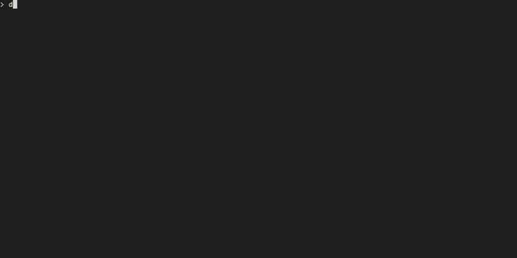

# VcrSharp

> **⚠️ WORK IN PROGRESS**
> This project is in early development and the API will change rapidly. If you need a stable, production-ready terminal recorder, please use [VHS](https://github.com/charmbracelet/vhs) instead. VcrSharp is experimental and should be considered alpha quality.

A .NET terminal recorder that turns `.tape` files into GIFs and videos. Write your terminal demos as code, then render them to video.

Inspired by [VHS](https://github.com/charmbracelet/vhs) by Charm Bracelet. VcrSharp adds better Windows support and the `Exec` command for capturing real command output instead of just simulating typing.



## Features

- Generate GIFs, MP4s, and WebM videos from tape files
- Works great on Windows (PowerShell, CMD) and cross-platform
- `Exec` command runs real shell commands and captures actual output
- 10 built-in themes (Dracula, Nord, Monokai, Gruvbox, Tokyo Night, etc.)
- Control typing speed, delays, and wait for specific output patterns
- Copy/paste and screenshot support
- Fully declarative — write your demos as code

## Installation

### Prerequisites

You'll need these installed and in your PATH:

- [.NET 9 SDK](https://dotnet.microsoft.com/download/dotnet/9.0)
- [ttyd](https://github.com/tsl0922/ttyd) (>= 1.7.2)
- [FFmpeg](https://ffmpeg.org/)

Playwright browsers install automatically on first run.

### Building from Source

```bash
git clone https://github.com/phil-scott-78/vcr.git
cd vcr
dotnet build VcrSharp.sln
```

### Running

```bash
# Record a tape file
dotnet run --project src/VcrSharp.Cli -- demo.tape

# Validate a tape file without recording
dotnet run --project src/VcrSharp.Cli -- validate demo.tape

# List available themes
dotnet run --project src/VcrSharp.Cli -- themes
```

## Quick Start

Create a file called `demo.tape`:

```tape
# Configure the output
Output demo.gif
Output demo.mp4

# Set terminal dimensions and theme
Set Width 1200
Set Height 600
Set Theme "Dracula"

# Type a command
Type "echo 'Hello, VcrSharp!'"
Enter
Sleep 1s

# Use Exec to run a real command
Exec "git status"
Sleep 2s
```

Then record it:

```bash
dotnet run --project src/VcrSharp.Cli -- demo.tape
```

This will generate both `demo.gif` and `demo.mp4` showing your terminal session.

## Command-Line Overrides

You can override tape file settings and add output formats directly from the command line without modifying your `.tape` files. This is useful for:

- **Testing different themes** without editing your tape
- **Generating multiple resolutions** from the same tape file
- **Adding output formats** on demand
- **Quick iterations** during development

### Override Settings with `--set`

Override any setting using `--set Key=Value`:

```bash
# Try different themes
dotnet run --project src/VcrSharp.Cli -- demo.tape --set Theme=Dracula
dotnet run --project src/VcrSharp.Cli -- demo.tape --set Theme=Nord

# Generate high-resolution output
dotnet run --project src/VcrSharp.Cli -- demo.tape --set Width=1920 --set Height=1080

# Adjust video settings
dotnet run --project src/VcrSharp.Cli -- demo.tape --set Framerate=60 --set PlaybackSpeed=1.5

# Change terminal appearance
dotnet run --project src/VcrSharp.Cli -- demo.tape --set FontSize=28 --set Padding=100 --set BorderRadius=10
```

CLI `--set` parameters **override** matching SET commands in the tape file. All 31 settings can be overridden (see [Configuration Reference](#configuration-reference)).

### Add Output Formats with `--output`

Add additional output files using `-o` or `--output`:

```bash
# Add MP4 output to a tape that only specifies GIF
dotnet run --project src/VcrSharp.Cli -- demo.tape --output demo.mp4

# Generate multiple formats
dotnet run --project src/VcrSharp.Cli -- demo.tape -o video.mp4 -o video.webm -o video.gif
```

CLI `--output` parameters **append** to Output commands in the tape file. If your tape specifies `Output demo.gif` and you add `--output demo.mp4`, both files will be generated.


**Generate the same demo with different themes:**

```bash
# Create variants for light and dark mode
dotnet run --project src/VcrSharp.Cli -- demo.tape --set Theme=Dracula -o dark-demo.gif
dotnet run --project src/VcrSharp.Cli -- demo.tape --set Theme="Solarized Light" -o light-demo.gif
```

**Reuse tape files for different screen sizes:**

```bash
# Mobile-sized demo
dotnet run --project src/VcrSharp.Cli -- tutorial.tape --set FontSize=12 -o mobile.gif

# Desktop-sized demo
dotnet run --project src/VcrSharp.Cli -- tutorial.tape --set FontSize=22 -o desktop.gif
```

## Examples

All examples below can be found in the `samples/` directory.

### Example 1: Basic Typing and Navigation (`samples/welcome.tape`)

Demonstrates typing, backspace, cursor navigation, and basic editing operations:

```tape
Output welcome.webm
Output welcome.gif

Set Width 1200
Set Height 600
Set TypingSpeed 40ms

Type "Welcome to VCR#!"
Sleep 0.5s
Backspace 16
Sleep 0.5s

Type "A tool for writing GIFs as code."
Sleep 0.5s
Left 14
Sleep 0.5s
Type " terminal"
Sleep 1s
End
Sleep 0.5s
Backspace 41
Sleep 0.5s

Type 'echo "Demo your CLIs and TUIs."'
Sleep 0.5s
Enter
Sleep 0.5s

Type "Let's take it for a spin"

Sleep 0.5s
Left 5
Sleep 0.5s
Type "gum"
Sleep 0.5s
Left 3
Backspace 20
Sleep 0.5s
End
Type " -s line ping google.com"
Sleep 0.5s
Enter

Wait
Type "clear"

Enter
```

### Example 2: Exec Command (`samples/exec-readme.tape`)

Uses the `Exec` command to run a real application and navigate with arrow keys:

```tape
Output exec-readme.webm

Set FontSize 18
Set Cols 80
Set Rows 30

Exec "glow --tui readme.md"
Sleep 1000ms
Down@100ms 30
Sleep 1s
Ctrl+C
```

### Example 3: Wait Patterns and Screenshots (`samples/input.tape`)

Demonstrates Wait commands, arrow key navigation, and screenshot capture:

```tape
Output input.webm

Set FontSize 12
Set Cols 80
Set Rows 30

Set TypingSpeed 250ms

Type@60ms "gum file --height 28"
Enter
Wait /select/

Down 9
Sleep 250ms
Up 3
Down 5
Sleep 500ms
Screenshot "file-picker.gif"
Enter
Sleep 2000ms
```

### Example 4: PowerShell Scripting (`samples/numbers.tape`)

Shows PowerShell commands with Wait patterns:

```tape
Output numbers.gif

Set Cols 80
Set Rows 20

Set TypingSpeed 10
Type "1..100 | ForEach-Object { $_; Start-Sleep -Milliseconds 100 }"
Enter
Wait /50/
```

## Command Reference

### Settings Commands

Configure your recording session. All settings have good defaults, so you only need to set what you want to change.

```tape
Set Width 1200              # Terminal width in pixels (default: 1200)
Set Height 600              # Terminal height in pixels (default: 600)
Set Cols 80                 # Terminal columns (character width, overrides Width)
Set Rows 24                 # Terminal rows (character height, overrides Height)
Set FontSize 22             # Font size in pixels (default: 22)
Set FontFamily "monospace"  # Font family (default: "monospace")
Set LetterSpacing 1.0       # Letter spacing multiplier (default: 1.0)
Set LineHeight 1.0          # Line height multiplier (default: 1.0)

Set Framerate 50            # Frames per second, 1-120 (default: 50)
Set PlaybackSpeed 1.0       # Playback speed multiplier (default: 1.0)
Set LoopOffset 0            # GIF loop offset percentage (default: 0)

Set Theme "Dracula"                # Color theme (default: "Default")
Set Padding 60                     # Padding around terminal in pixels (default: 60)
Set Margin 0                       # Margin around recording in pixels (default: 0)
Set MarginFill "#000000"           # Margin fill color or image path (default: null)
Set WindowBarSize 30               # Window bar height in pixels (default: 30)
Set BorderRadius 0                 # Border radius in pixels (default: 0)
Set CursorBlink true               # Enable cursor blinking (default: true)
Set TransparentBackground true     # Enable transparent terminal background (default: false)

Set Shell "pwsh"            # Shell to use (default: platform-specific)
Set TypingSpeed 150ms       # Default typing speed (default: 150ms)
Set WaitTimeout 15s         # Max wait time for patterns (default: 15s)
Set InactivityTimeout 5s    # Inactivity timeout for Exec (default: 5s)
Set StartWaitTimeout 10s    # Wait for first terminal activity (default: 10s)
Set StartBuffer 500ms       # Blank time before first activity (default: 500ms)
Set EndBuffer 1s            # Time after last activity (default: 1s)
```

### Output Commands

Specify one or more output files. VcrSharp supports GIF, MP4, and WebM formats:

```tape
Output demo.gif        # Generate an animated GIF
Output demo.mp4        # Generate an MP4 video
Output demo.webm       # Generate a WebM video
```

### Typing & Input Commands

Simulate keyboard input:

```tape
Type "hello world"          # Type text character by character
Type@500ms "slow typing"    # Type with custom speed override

Enter                       # Press Enter
Enter 3                     # Press Enter 3 times
Backspace                   # Press Backspace
Backspace 5                 # Press Backspace 5 times
Tab                         # Press Tab
Escape                      # Press Escape
Space                       # Press Space

# Arrow keys
Up                          # Press Up arrow
Down                        # Press Down arrow
Left                        # Press Left arrow
Right 10                    # Press Right arrow 10 times
Left@100ms 2                # Press Left arrow 2 times with custom speed

# Navigation keys
PageUp                      # Press Page Up
PageDown                    # Press Page Down
Home                        # Press Home
End                         # Press End
Delete                      # Press Delete
Insert                      # Press Insert
```

#### String Quoting and Escape Sequences

VcrSharp supports three quote styles for string values:

```tape
Type "double quotes"        # Supports escape sequences
Type 'single quotes'        # Completely literal (no escapes)
Type `backticks`            # Completely literal (no escapes)
```

**Escape Sequences in Double-Quoted Strings:**

Only double-quoted strings process escape sequences. Single quotes and backticks treat all characters literally.

| Escape | Result | Example |
|--------|--------|---------|
| `\n` | Newline | `Type "Line 1\nLine 2"` |
| `\t` | Tab | `Type "Name\tValue"` |
| `\r` | Carriage return | `Type "Before\rAfter"` |
| `\\` | Backslash | `Type "C:\\\\Users\\\\Name"` |
| `\"` | Double quote | `Type "Say \"Hello\""` |

**Handling Mixed Quotes:**

```tape
# Use backticks for text with both quotes and apostrophes (recommended)
Type `This is "my story's end"`

# Use double quotes with escapes
Type "This is \"my story's end\""

# Use single quotes when text contains mostly double quotes
Type 'echo "Hello, World!"'

# Use double quotes when text contains mostly apostrophes
Type "It's a beautiful day"
```

**Unknown Escape Sequences:**

Unknown escape sequences are preserved for backward compatibility. For example, `\U` in `"C:\Users"` remains as-is, making Windows paths work without modification.

```tape
# Windows paths work without escaping (unknown \U and \N preserved)
Type "cd C:\Users\Name"

# If you need literal backslashes, use single quotes or backticks
Type 'C:\Users\Name'
Type `C:\Users\Name`

# Or use double backslashes in double quotes
Type "C:\\\\Users\\\\Name"
```

### Modifier Key Combinations

Press key combinations with Ctrl, Alt, and Shift:

```tape
Ctrl+C                      # Interrupt/cancel
Ctrl+D                      # EOF/exit
Alt+Enter                   # Alt+Enter combination
Shift+Tab                   # Shift+Tab combination
Ctrl+Alt+Delete             # Multiple modifiers
```

### Control Flow Commands

Control timing and frame capture:

```tape
Sleep 1s                    # Pause for 1 second
Sleep 500ms                 # Pause for 500 milliseconds
Sleep 2m                    # Pause for 2 minutes

Hide                        # Stop capturing frames (commands still execute)
Show                        # Resume capturing frames

Screenshot output.png       # Capture current frame to file
```

### Wait Commands

Wait for specific output patterns before continuing. Great for async operations like builds or server startup:

```tape
Wait                        # Wait for default shell prompt pattern
Wait /pattern/              # Wait for regex pattern in buffer
Wait+Buffer /pattern/       # Wait for pattern in buffer since last Wait (default)
Wait+Line /pattern/         # Wait for pattern in current line only
Wait+Screen /pattern/       # Wait for pattern anywhere on visible screen
Wait@5s /pattern/           # Wait with custom timeout (5 seconds)
Wait+Buffer@2s /Build/      # Combined scope, timeout, and pattern

# Examples
Wait /Build succeeded/      # Wait for build completion
Wait+Screen /listening/     # Wait for server to start
Wait@30s /Downloaded/       # Wait up to 30 seconds for download
```

Scopes:
- `Wait` or `Wait+Buffer` - Search in buffer accumulated since last Wait (default)
- `Wait+Line` - Search current line only
- `Wait+Screen` - Search entire visible screen

You can override the timeout with `Wait@<duration>`.

### Exec Command

The big difference from VHS: execute real shell commands and capture actual output.

```tape
Exec "git status"           # Run git status and capture real output
Exec "npm install"          # Run npm install with actual progress
Exec "dotnet build"         # Build a project and show real compiler output
Exec "python script.py"     # Run scripts with real results
```

How it works: runs the command in your shell, waits for it to finish using inactivity detection, then captures the real output.

Configure timeouts:
```tape
Set InactivityTimeout 5s    # How long to wait after output stops
Set WaitTimeout 15s         # Max time to wait for command to finish
```

### Clipboard Commands

Copy and paste operations:

```tape
Copy "text to copy"         # Copy text to clipboard
Paste                       # Paste clipboard contents
```

### Environment & Requirements

Set environment variables and validate dependencies:

```tape
Env NODE_ENV "production"   # Set environment variable
Env API_KEY "secret"        # Set another environment variable

Require git                 # Ensure git is installed
Require npm                 # Ensure npm is installed
Require dotnet              # Ensure dotnet is installed
```

### Source Command

Include another tape file inline:

```tape
Source setup.tape           # Include setup.tape at this location
```

## Available Themes

VcrSharp includes 10 built-in themes:

1. **Default** - VS Code Dark+
2. **Dracula** - Dark theme with purple accents
3. **Monokai** - Classic code editor theme
4. **Nord** - Arctic, north-bluish color palette
5. **Solarized Dark** - Popular dark theme with muted colors
6. **Solarized Light** - Light variant of Solarized
7. **One Dark** - Atom's iconic dark theme
8. **Gruvbox Dark** - Retro groove color scheme
9. **Tokyo Night** - Clean, dark theme inspired by Tokyo
10. **Catppuccin Mocha** - Warm, pastel theme

View all themes with:
```bash
dotnet run --project src/VcrSharp.Cli -- themes
```

Use a theme in your tape file:
```tape
Set Theme "Tokyo Night"
```

## Configuration Reference

### Terminal Settings

| Setting | Default | Description |
|---------|---------|-------------|
| `Width` | 1200 | Terminal width in pixels |
| `Height` | 600 | Terminal height in pixels |
| `Cols` | - | Terminal columns (character width, overrides Width) |
| `Rows` | - | Terminal rows (character height, overrides Height) |
| `FontSize` | 22 | Font size in pixels |
| `FontFamily` | "monospace" | Font family name |
| `LetterSpacing` | 1.0 | Letter spacing multiplier |
| `LineHeight` | 1.0 | Line height multiplier |

### Video Settings

| Setting | Default | Description |
|---------|---------|-------------|
| `Framerate` | 50 | Frames per second (1-120) |
| `PlaybackSpeed` | 1.0 | Playback speed multiplier |
| `LoopOffset` | 0 | GIF loop offset percentage |

### Styling

| Setting | Default | Description |
|---------|---------|-------------|
| `Theme` | "Default" | Color theme name |
| `Padding` | 60 | Padding around terminal (px) |
| `Margin` | 0 | Margin around recording (px) |
| `MarginFill` | null | Margin fill color or image |
| `WindowBarSize` | 30 | Window bar height (px) |
| `BorderRadius` | 0 | Border radius (px) |
| `CursorBlink` | true | Enable cursor blinking |
| `TransparentBackground` | false | Enable transparent terminal background |

### Behavior & Timing

| Setting | Default | Description |
|---------|---------|-------------|
| `Shell` | Platform-specific | Shell to use (pwsh, cmd, bash) |
| `TypingSpeed` | 150ms | Default character typing delay |
| `WaitTimeout` | 15s | Max wait time for patterns |
| `InactivityTimeout` | 5s | Inactivity timeout for Exec |
| `StartWaitTimeout` | 10s | Wait for first activity |
| `StartBuffer` | 500ms | Blank time before recording |
| `EndBuffer` | 1s | Time after last activity |

## Differences from VHS

VcrSharp is inspired by [VHS](https://github.com/charmbracelet/vhs), but there are some differences:

### What's Different

- **Better Windows support** - Works great with PowerShell and CMD
- **Exec command** - Run real commands instead of just simulating typing
- **Advanced wait patterns** - Wait for output on current line or entire screen
- **Inactivity detection** - Automatically detects when commands finish

### What's Missing

VcrSharp only generates videos from tape files. These VHS features aren't implemented:

- **publish** - Publishing to hosting services
- **record** - Interactive recording mode
- **serve** - Preview server

If you need those features, use VHS. If you want scriptable, version-controlled terminal recordings that work well on Windows, VcrSharp might be for you.

### Why VCR and not VHS?

I kept typing VCR when using VHS, no one called is VHS back in the day.

## CLI Commands

### Record (Default Command)

```bash
vcr <tape-file> [OPTIONS]
dotnet run --project src/VcrSharp.Cli -- demo.tape
```

Records the tape file and generates output videos/GIFs.

**Options:**

- `--set <KEY=VALUE>` - Override a setting from the tape file. Can be specified multiple times. CLI settings override tape file SET commands.
- `-o, --output <FILE>` - Add an additional output file. Can be specified multiple times. CLI outputs are appended to tape file Output commands.
- `-v, --verbose` - Enable verbose logging for debugging.

**Examples:**

```bash
# Override theme and dimensions
dotnet run --project src/VcrSharp.Cli -- demo.tape --set Theme=Dracula --set Width=1920 --set Height=1080

# Add multiple output formats
dotnet run --project src/VcrSharp.Cli -- demo.tape -o demo.mp4 -o demo.webm

# Combine settings and outputs
dotnet run --project src/VcrSharp.Cli -- demo.tape \
  --set Theme=Nord \
  --output hires.gif \
  --output hires.mp4
```

All 31 settings can be overridden via `--set`. See the [Configuration Reference](#configuration-reference) for available settings.

### Validate

```bash
vcr validate <tape-file>
dotnet run --project src/VcrSharp.Cli -- validate demo.tape
```

Check your tape file syntax without actually recording anything. Shows parse errors, command counts, and configuration.

### Themes

```bash
vcr themes
dotnet run --project src/VcrSharp.Cli -- themes
```

Lists all available themes with color previews.

## Sample Tape Files

Check out the `samples/` directory for examples of `.tape` files in action.

## Project Structure

```
VcrSharp/
├── src/
│   ├── VcrSharp.Cli/              # CLI application
│   ├── VcrSharp.Core/             # Core logic (parsing, commands)
│   └── VcrSharp.Infrastructure/   # External integrations (Playwright, FFmpeg)
├── tests/
│   ├── VcrSharp.Core.Tests/       # Unit tests
│   └── VcrSharp.Integration.Tests/# Integration tests
├── samples/                        # Example tape files
└── README.md
```

## Contributing

Found a bug? Have an idea? Open an issue or submit a PR.

## Attribution

This project is inspired by [VHS](https://github.com/charmbracelet/vhs) by [Charm Bracelet](https://charm.sh/). Seriously, go check out their work — it's great.

## License

This project is licensed under the MIT License - see the [LICENSE](LICENSE) file for details.
